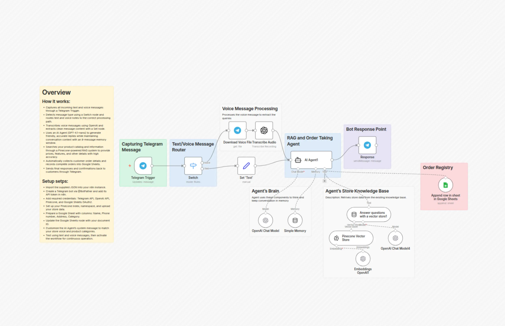

# Create an AI Shopping Assistant on Telegram with GPT-4.1, Voice Recognition & Google Sheets

Advanced n8n automation for Create an AI Shopping Assistant on Telegram with GPT-4.1, Voice Recognition & Google Sheets.

## Overview
- Category: Lead Nurturing, AI RAG
- Complexity: advanced
- Source: n8n workflow template export

## What This Automation Does
Revolutionize your e-commerce sales with a smart AI Telegram botautomated order taking, multilingual support, and instant product search. Learn more!

## Included Files
- `workflow.json`

## Setup
1. Import `workflow.json` into n8n.
2. Configure required credentials for the services used in the workflow nodes.
3. Update any environment variables or static values inside nodes (API keys, URLs, IDs).
4. Run a test execution and then activate the workflow.

## Tech Stack

- `@n8n/n8n-nodes-langchain.agent`
- `@n8n/n8n-nodes-langchain.embeddingsOpenAi`
- `@n8n/n8n-nodes-langchain.lmChatOpenAi`
- `@n8n/n8n-nodes-langchain.memoryBufferWindow`
- `@n8n/n8n-nodes-langchain.openAi`
- `@n8n/n8n-nodes-langchain.toolVectorStore`
- `@n8n/n8n-nodes-langchain.vectorStorePinecone`
- `n8n-nodes-base.googleSheetsTool`
- `n8n-nodes-base.set`
- `n8n-nodes-base.stickyNote`
- `n8n-nodes-base.switch`
- `n8n-nodes-base.telegram`
- `n8n-nodes-base.telegramTrigger`

## Author

Murtaza Baig

## Screenshots

## License
MIT License. See `LICENSE`.